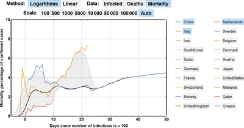
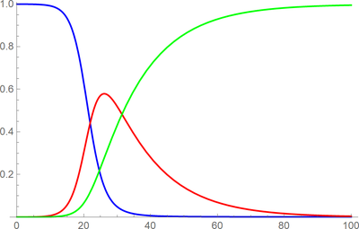

# COVID-19

Code, data, and computational resources related to COVID-19 for the Wolfram Language

All notebooks in this repository are available on the Wolfram Cloud.

Click the red button below to access the list of notebook directly:

### Visualizing Epidemic Data

### S-I-R Equation Model

